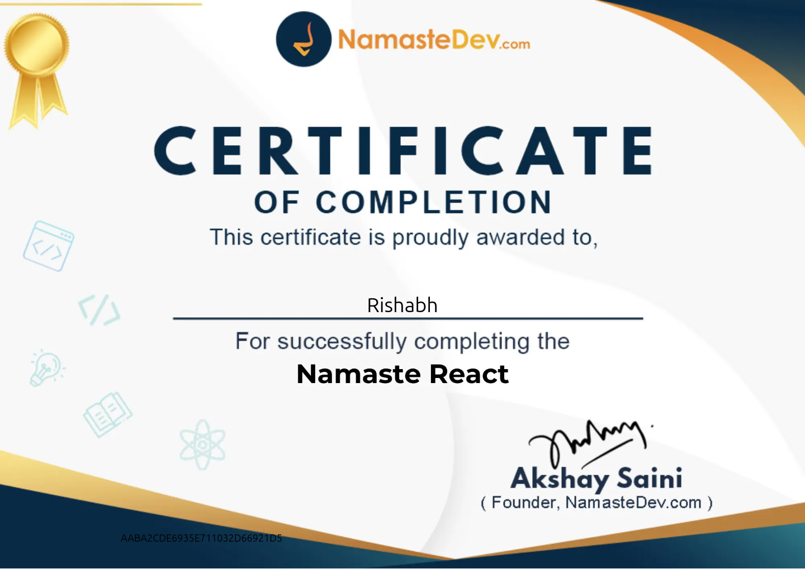
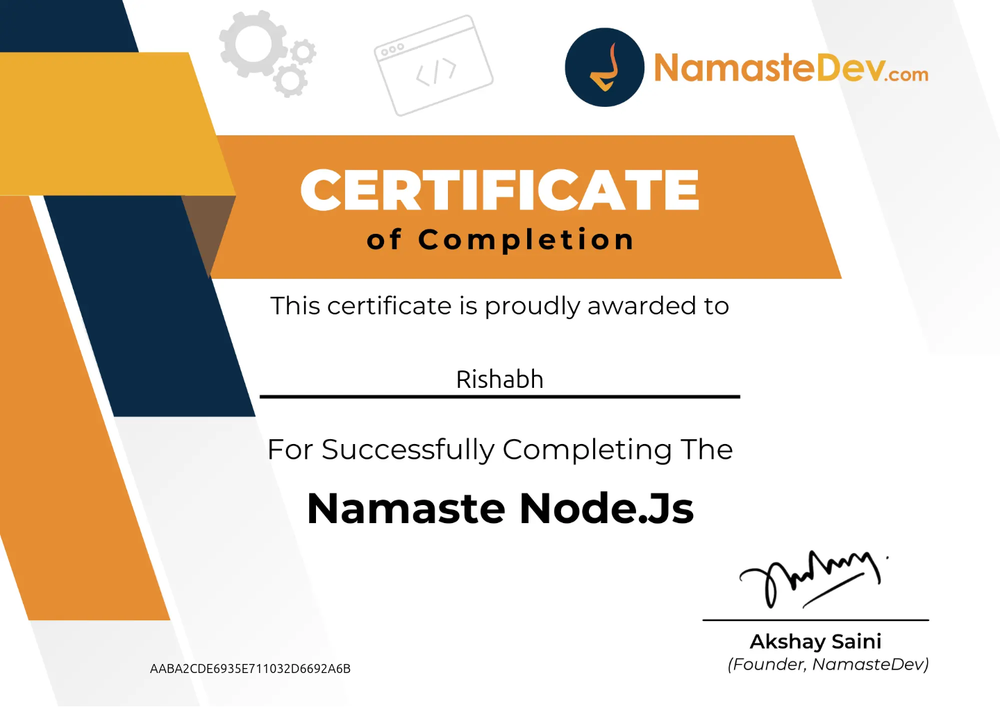
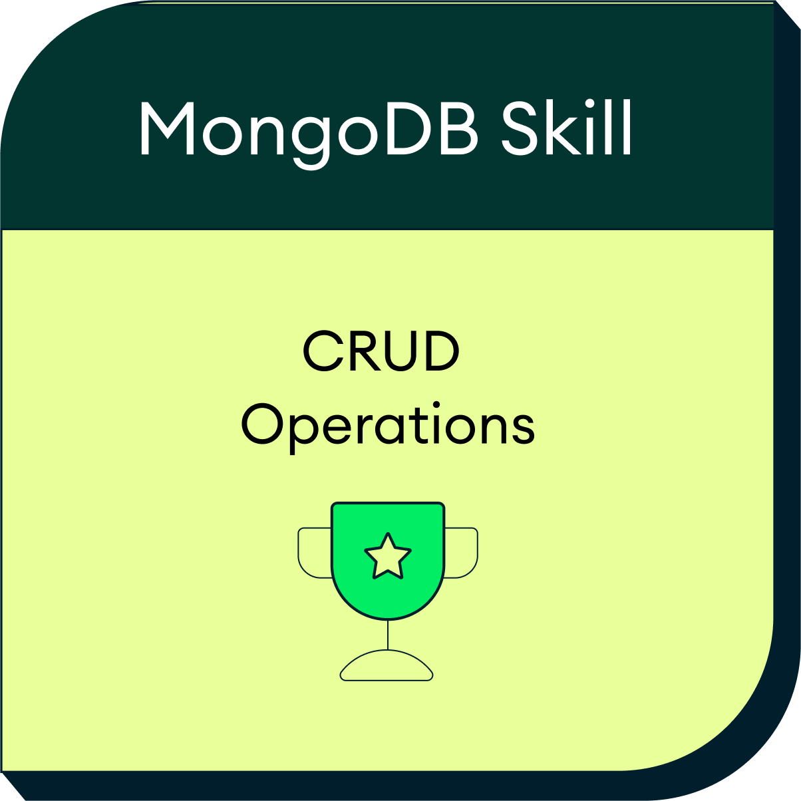

# Certificates

Course completion certificates and skill badges I've earned, kept here for reference.

| Certificate | Issued by | Date | File |
|---|---|---|---|
| **Namaste React** | [NamasteDev.com](https://namastedev.com) — Akshay Saini | Jul 2026 | [Namaste-React.png](Namaste-React.png) |
| **Namaste Node.js** | [NamasteDev.com](https://namastedev.com) — Akshay Saini | Jul 2026 | [Namaste-Nodejs.png](Namaste-Nodejs.png) |
| **CRUD Operations in MongoDB** | MongoDB | Aug 12, 2026 | [PDF](SkillsCert20260812-22-wbsazz.pdf) · [badge](crud-operations-in-mongodb_badge.png) · [verify on Credly](https://www.credly.com/badges/8141d7d0-35ee-4118-a779-d17a9159b738) |

## Namaste React

## Namaste Node.js

## CRUD Operations in MongoDB

Verifiable at [credly.com/badges/8141d7d0-35ee-4118-a779-d17a9159b738](https://www.credly.com/badges/8141d7d0-35ee-4118-a779-d17a9159b738).

---

More of my work: [github.com/Rishubegin](https://github.com/Rishubegin)
